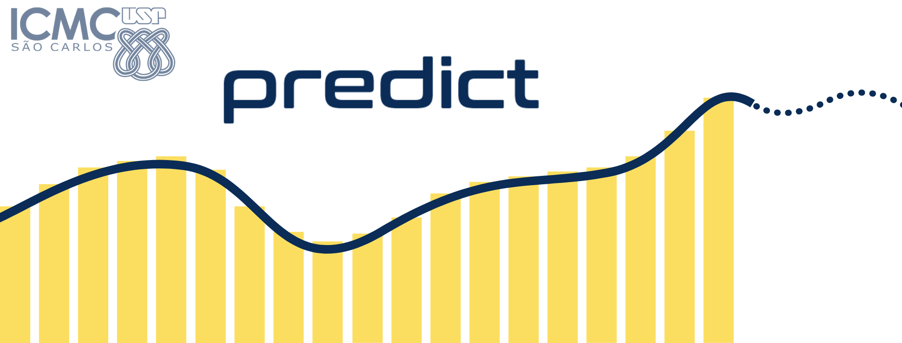

class: center, hide-logo



## Apresentação do Projeto
#### Universidade de São Paulo
### Junho 2021

---

# Algumas cenas de hoje...

- Apresentação do projeto
- Modelagem matemática
  - Regressão: Como prever novos casos?
  - Classificação: Fatores de risco do covid-19
  
- Alguns modelos:
  - SARIMA
  - Redes Neurais
  
- Análises de impacto

---
# O que é o PREDICT?

O PREDICT-ICMC é um grupo de extensão que visa a **análise de dados** da pandemia de COVID-19 por meio de:
--

- técnicas de visualização de dados, e

- modelos preditivos

para o dimensionamento e prevenção dos impactos do COVID-19 e outras síndromes respiratórias agudas graves, utilizando estatística e ciência de dados.

## Como começou?

O projeto teve suas atividades iniciadas em Maio de 2020 a partir de uma iniciativa da Profa Cibele e dos alunos do curso de Estatística e Ciência de Dados

---

## O que fazemos? 

Nossa proposta envolve a predição do número de casos, óbitos e demanda de internações hospitalares decorrentes do COVID-19 de acordo com diferentes intervenções:
  - medidas de distanciamento social,
  - isolamento voluntário,
  - isolamento de sintomáticos,
  - uso de equipamentos de proteção individual (EPIs),
  - monitoramento de contatos próximos ou domiciliares,
  - triagem em serviços de saúde, entre outras. 

---
# Modelagem Matemática

Temos dois principais problemas em modelagem:
 - **regressão**: Encontrar uma curva que se ajuste "adequadamente" aos dados observados,
 - **classificação**: tentar predizer o comportamento de determinada variável a partir dos dados observados.
```{r, pkg-load, echo= FALSE, warning=FALSE, message = FALSE}
library(tidyverse)
library(e1071)
library(plotly)
```
---
### **Regressão**: Qual tipo de função você ajustaria aos pontos abaixo?

```{r echo= F, warning=FALSE, message=FALSE}
ggplot(mapping = aes(x = seq(from = -1, to = 1, by= 0.1), y = sigmoid(seq(from = -1, to = 1, by= 0.1)))) + geom_point() + xlab("x") + ylab(expr(f(x)))

```
---
### Utilizando regressão linear, $\ y = ax + b$
```{r echo= F, message=F}
ggplot(mapping = aes(
  x = seq(from = -1, to = 1, by= 0.1), 
  y = sigmoid(seq(from = -1, to = 1, by= 0.1)))) + 
  geom_point() +
  stat_smooth(method = "lm") +
  xlab("x") +
  ylab(expr(f(x)))

```
---
### Mas e se aumentarmos o intervalo de $f(x)$?
--
```{r echo= F}
ggplot(mapping = aes(x = seq(from = -10, to = 10, by= 0.1), y = sigmoid(seq(from = -10, to = 10, by= 0.1)))) + geom_point() + xlab("x") + ylab(expr(f(x)))
```

---
class: hide-logo

A função plotada era, na verdade, uma **sigmóide** $y = \frac{1}{1 + e^{-x}}$
No início de nosso trabalho de modelagem, utilizamos esta família de funções para tentar prever o "achatamento da curva"

```{r gompertz-model, echo = FALSE}
library(nls.multstart)

#modelo gompertz auto inicializavel para numero diario total de casos confirmados

fit.Gompertz <- function(treino){
  
  fit.Gompertz.1 <- nlsLM(last_available_confirmed ~ SSgompertz(tempo, Asym, b2, b3),
                             data = treino)
  
  XX = (0:(max(treino$tempo)+14))
  
  Asym.G<-coef(fit.Gompertz.1)[1]
  b2.G<-coef(fit.Gompertz.1)[2]
  b3.G<-coef(fit.Gompertz.1)[3]
     
  yp.G<-Asym.G*exp((-b2.G)*(b3.G)^XX)
       
  return (tibble(x=XX,y=yp.G))
}
```
```{r echo = FALSE, message = FALSE}
library(modelr)
library(minpack.lm)

selectedCity <- data.table::fread("sp.csv")

treino1G <- selectedCity %>% select(tempo, last_available_confirmed) %>% filter(tempo < 181)
teste1G <- selectedCity %>% select(tempo, last_available_confirmed) %>% filter(tempo %in% 181:195)

fit1G <- fit.Gompertz(treino1G)

g1 <- ggplot() +
  geom_col(aes(x = tempo, y = last_available_confirmed), data = treino1G) +
  geom_col(aes(x = tempo, y = last_available_confirmed, color = "Observado"), data = teste1G) +
  geom_line(aes(x=x, y = y, color = "Modelo de Gompertz"), data = fit1G) +
  xlab("Dias após primeiro caso confirmado") + ylab("Total de casos confirmados")

g1
```

---

## Classificação: fatores de risco do covid-19

```{r echo = FALSE, message = FALSE}
library(sjPlot)
library(sjmisc)
library(sjlabelled)

set.seed(123)

comorb <- read_csv("comorbidades.csv")

fit <- glm(obito  ~ idade + cs_sexo + asma + cardiopatia + diabetes +
             doenca_hematologica +      doenca_hepatica +
             doenca_neurologica      + doenca_renal +
             imunodepressao          + obesidade +
             outros_fatores_de_risco + pneumopatia +
             puerpera                + sindrome_de_down,
           family = binomial(link=logit), data = comorb)

tab_model(fit, show.icc = F, transform = NULL)
```
---
class: center

Acesse nosso dashboard!

https://predict-icmc.shinyapps.io/covid-19/

````{css, echo = F}
.bg_karl {
  position: relative;
  z-index: 1;
}

.bg_karl::before {    
      content: "";
      background-image: url('https://github.com/predict-icmc/covid19/raw/master/shiny/site_final/covid-19/www/logo-predict.jpg');
      background-size: cover;
      position: absolute;
      top: 0px;
      right: 0px;
      bottom: 0px;
      left: 0px;
      opacity: 0.2;
      z-index: -1;
}
````

