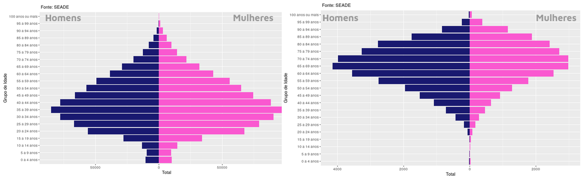
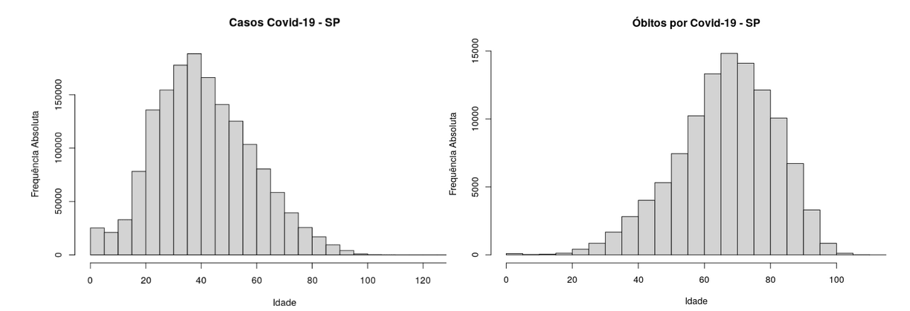
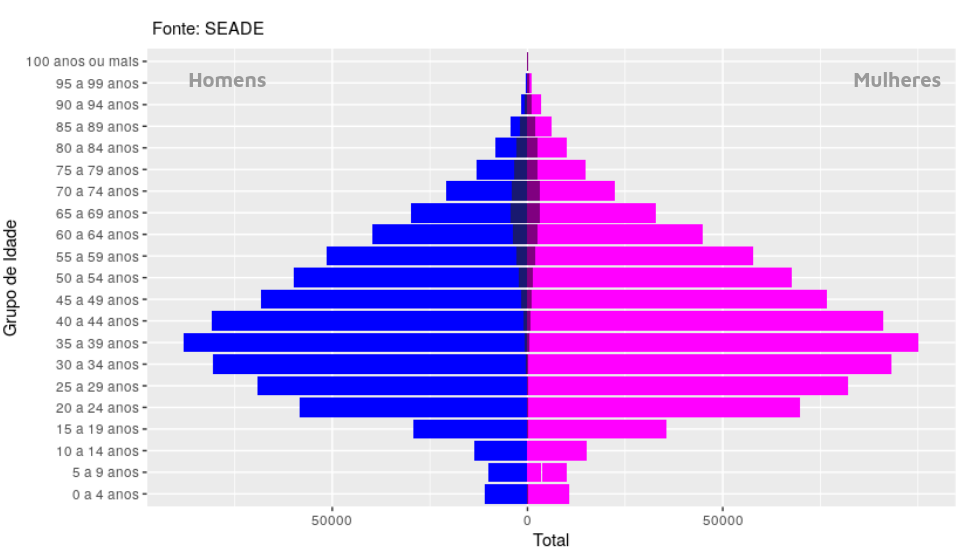

class: center, hide-logo


## Visualização dos impactos sociais da COVID-19
  
  + Flaviane Louzeiro da Silva
  + Francisco Rosa Dias de Miranda
  + Cibele Maria Russo Novelli

#### Universidade de São Paulo 
#### Instituto de Ciências Matemáticas e Computação

---
# Objetivo

- Desenvolver a análise de impacto da pandemia de COVID-19 nos segmentos sociais, utilizando técnicas de estatística e ciência de dados através de duas frentes:

  + desenvolvimento de uma ferramenta de visualização iterativa disponibilizada em um website. 

  + impacto da pandemia na pirâmide etária, comparando números totais de casos e óbitos registrados, segmentados pelas variáveis sexo e idade.

# Métodos e Procedimentos

- Um dos grandes desafios encontrados foi o acesso a bases de dados consistentes e atualizadas sobre a pandemia de COVID-19.

---

# Métodos e Procedimentos

## Bases de Dados

Considerando os repositórios disponíveis, optamos pelo uso de duas bases de dados:

--

  - Brasil.IO (Brasil.IO, 2021)
  
    - Boletins epidemiológicos das Secretarias Estaduais de Saúde
    - Óbitos registrados nos cartórios e disponíveis no Portal da Transparência do Registro Civil

--

  - Fundação Sistema Estadual de Análise de Dados - SEADE (SEADE, 2021)
    
   - Dentre os painéis disponíveis, há o painel com o Boletim Completo sobre o Coronavírus, que exibe a evolução diária e acumulativa dos números de casos e óbitos, a porcentagem de leitos livres e ocupados, além da situação por municípios paulistas.

---

# Resultados

## Aplicação web com atualização diária (PREDICT, 2021)

Foco na interação com o usuário, que é capaz de controlar parâmetros como paleta de cores e quantidade de classes, para visualizar mapas com variáveis de interesse, como número de casos, óbitos, andamento de campanhas de testagem e vacinação.

<https://predict-icmc.shinyapps.io/covid-19/>

---

# Resultados

## Impacto na pirâmide etária



Apresentamos as pirâmides etárias, com classes agrupadas em intervalos fixos de 5 anos, dos registros de casos e óbitos, no período de 04 de fevereiro de 2020 a 16 de maio de 2021 

---



- É possível concluir que a maioria dos casos concentra-se no intervalo de 20 a 50 anos, onde a faixa com mais registros é de 35 a 40 anos.

- Esse resultado era esperado, pois cerca de 59,6% dos trabalhadores brasileiros possuem de 25 a 59 anos (PNADC, 2020). 
---




- No entanto, com base na pirâmide etária dos registros de óbitos, observa-se que a maioria dos registros concentra-se no intervalo de 60 a 80 anos, onde a faixa etária de 65 a 70 anos apresentaram maior ocorrência.

---
# Conclusões

 - A utilização de técnicas de visualização de dados mostrou-se conveniente nos estudos de impacto da Covid-19.

 - A  visualização dos dados em estilo de mapa, exibindo os resultados dentro de escalas de cor adequadas  permitiu, de modo didático, o acompanhamento da evolução da Covid-19 pelo país.
 
 - Pôde-se observar que os casos de Covid-19, tanto nos homens quanto nas mulheres, concentrou-se na faixa de 35 a 39 anos.

 - No entanto, para os registro de óbitos, observa-se que o sexo masculino foi o mais registrado, com a faixa de 65 a 69 anos sendo a mais frequente.

---

# O que é o PREDICT?

--

O PREDICT-ICMC é um grupo de extensão que visa a **análise de dados** da pandemia de COVID-19 por meio de:

- técnicas de visualização de dados, 

- modelos preditivos

--

## O que fazemos? 

--

Nossa proposta envolve a predição do número de casos, óbitos e demanda de internações hospitalares decorrentes do COVID-19 de acordo com diferentes intervenções:
  - medidas de distanciamento social,
  - isolamento voluntário,
  - isolamento de sintomáticos,
  - uso de equipamentos de proteção individual (EPIs),
  - monitoramento de contatos próximos ou domiciliares,
  - triagem em serviços de saúde, entre outras. 

---

# Referências Bibliográficas

*Brasil.IO*. O Brasil em dados libertos. 2021. Disponível em https://brasil.io/ . Acesso em 16/05/2021.

*PNADC*. Pesquisa Nacional por Amostra de Domicílios Contínua - Segundo trimestre de 2020, Indicadores IBGE .  Disponível em 
https://biblioteca.ibge.gov.br. Acesso em  06/06/2021

*PREDICT*. Painel interativo do covid-19. 2021. Disponível em predict-icmc.shinyapps.io/covid-19/. Acesso em 16/05/2021.

*SEADE*. Fundação Sistema Educacional de Análise de Dados. 2021. Disponível em https://www.seade.gov.br/. Acesso em 16/05/2021. 


````{css, echo = F}
.bg_karl {
  position: relative;
  z-index: 1;
}

.bg_karl::before {    
      content: "";
      background-image: url('https://github.com/predict-icmc/covid19/raw/master/shiny/site_final/covid-19/www/logo-predict.jpg');
      background-size: cover;
      position: absolute;
      top: 0px;
      right: 0px;
      bottom: 0px;
      left: 0px;
      opacity: 0.2;
      z-index: -1;
}
````

